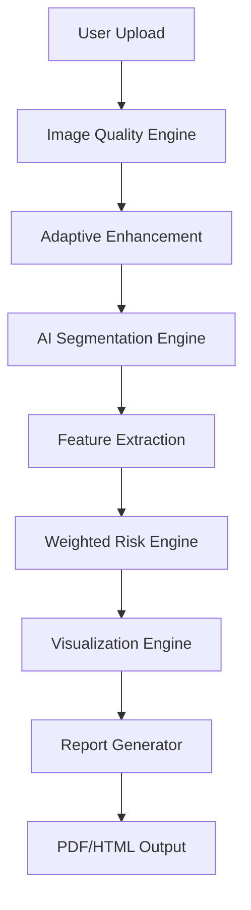

# 🧠 TumorInsight: Adaptive AI-Based Medical Image Enhancement & Tumor Risk Analysis

[](https://www.python.org/)
[](https://flask.palletsprojects.com/)
[](https://opencv.org/)
[](LICENSE)

**TumorInsight** is a professional-grade medical imaging platform designed to assist radiologists and clinicians in the enhancement, detection, segmentation, and risk assessment of brain tumors from MRI and CT scans. By integrating adaptive image processing with automated morphological analysis, the system provides high-precision diagnostic support and explainable AI insights.

---

## 📖 Table of Contents
- [Overview](#overview)
- [Problem Statement](#problem-statement)
- [Solution Approach](#solution-approach)
- [Key Features](#key-features)
- [Technology Stack](#technology-stack)
- [System Architecture](#system-architecture)
- [Project Folder Structure](#project-folder-structure)
- [Installation Guide](#installation-guide)
- [How to Run](#how-to-run)
- [AI Workflow](#ai-workflow)
- [API Endpoints](#api-endpoints)
- [Future Improvements](#future-improvements)
- [Author](#author)

---

## 🔍 Overview
TumorInsight transforms raw medical scans into actionable clinical intelligence. It features a modern web dashboard where users can upload DICOM/JPG/PNG scans, apply adaptive enhancement filters, segment potential tumor regions, and compute a quantitative risk score. The platform concludes the diagnostic path by generating comprehensive medical reports in PDF, HTML, or JSON formats.

## ⚠️ Problem Statement
1. **Low Contrast Scans**: MRI and CT scans often suffer from noise and low contrast, making small tumorous fibers difficult to distinguish.
2. **Subjective Interpretation**: Manual analysis varies between specialists, leading to potential inconsistencies in risk assessment.
3. **Time-Intensive Workflow**: Correlating morphological features (area, circularity, texture) manually is time-consuming for clinicians.
4. **Lack of Quantification**: Traditional reports often lack precise pixel-level area ratios and texture heterogeneity metrics.

## ✅ Solution Approach
The system employs a **Hybrid Diagnostic Pipeline**:
- **Adaptive Enhancement**: Uses noise variance estimation to automatically tune CLAHE and smoothing filters.
- **Automated Segmentation**: Combines Otsu's thresholding with morphological cleanup and contour detection.
- **Explainable Risk Scoring**: A weighted engine calculates risk based on Area, Irregularity (Circularity/Solidity), Edge Density, and Texture (GLCM).
- **Interactive Visualization**: Generates heatmaps and split-view comparisons to highlight regions of interest.

---

## ✨ Key Features
- **DICOM Support**: Built-in support for medical-standard DICOM files.
- **Adaptive Filtering**: Selects between CLAHE, Gaussian, and Median filters based on image entropy and noise levels.
- **Advanced Segmentation**: Detects multiple tumor regions and classifies them (e.g., Meningioma, Glioma) based on morphology.
- **Texture Analysis**: Implements Gray-Level Co-occurrence Matrix (GLCM) to measure tumor heterogeneity.
- **Automated Reporting**: Generates "Clinical Intelligence" reports with detailed metrics and AI-driven natural language insights.
- **Quality Assessment**: Evaluates the diagnostic quality of uploaded scans before processing.

---

## 🛠 Technology Stack
- **Backend**: [Flask](https://flask.palletsprojects.com/) (Python)
- **Computer Vision**: [OpenCV](https://opencv.org/), [Scikit-Image](https://scikit-image.org/)
- **Mathematical Computation**: [NumPy](https://numpy.org/), [SciPy](https://scipy.org/)
- **Visualizations**: [Plotly](https://plotly.com/), [Matplotlib](https://matplotlib.org/)
- **Report Generation**: [ReportLab](https://www.reportlab.com/)
- **Frontend**: HTML5, Vanilla CSS3 (Modern Glassmorphism UI), JavaScript (ES6+)

---

## 🏗 System Architecture



---

## 📂 Project Folder Structure
```text
TumorInsight/
├── app.py                  # Main Flask Server & API Routes
├── ai_analysis.py          # Tumor Detection & Segmentation Module
├── image_enhancer.py       # Adaptive Filtering & Noise Analysis
├── risk_engine.py          # Weighted Scoring & NL Insights
├── visualization_engine.py # Heatmap & Overlay Generation
├── advanced_analytics.py   # Quality Metrics & Region Ranking
├── report_generator.py     # PDF/HTML Export Logic
├── requirements.txt        # Project Dependencies
├── static/                 # CSS, JS, and Assets
│   ├── css/
│   ├── js/
│   └── uploads/            # Processed Images (ignored by git)
├── templates/              # HTML Dashboards & UI
└── exports/                # Generated Medical Reports
```

---

## 🚀 Installation Guide

### Prerequisites
- Python 3.8 or higher
- Git

### Steps
1. **Clone the Repository**
   ```bash
   git clone https://github.com/Vanjinathan23/TumorInsight.git
   cd TumorInsight
   ```

2. **Create a Virtual Environment**
   ```bash
   python -m venv venv
   source venv/bin/activate  # On Windows: venv\Scripts\activate
   ```

3. **Install Dependencies**
   ```bash
   pip install -r requirements.txt
   ```

---

## 🖥 How to Run the Project
1. **Start the Flask Server**
   ```bash
   python app.py
   ```
2. **Access the Dashboard**
   Open your browser and navigate to:
   `http://127.0.0.1:5000`

---

## 🤖 AI Workflow Explanation

### 1. Enhancement Stage
The `image_enhancer.py` module estimates the Laplacian variance of the image. If noise is high, it prioritizes Median filters; if contrast is low, it applies CLAHE with dynamically calculated tile sizes.

### 2. Detection Stage
`ai_analysis.py` converts the image to grayscale, applies Otsu's binarization, and performs morphological opening to remove small artifacts. Contours are extracted and filtered by a `min_area` threshold (default 500px).

### 3. Feature Extraction & Classification
For each detected region, the system calculates:
- **Circularity**: (4 $\pi$   $\times$ Area) / Perimeter²
- **Solidity**: Area / Convex Hull Area
- **GLCM Contrast**: Measures texture variation.

### 4. Risk Assessment
`risk_engine.py` applies a weighted formula:
**Risk = (Area × 0.35) + (Irregularity × 0.25) + (Edge Density × 0.25) + (Texture × 0.15)**
The result is mapped to **Low**, **Medium**, or **High** risk levels.

---

## 🔌 API Endpoints
| Endpoint | Method | Description |
| :--- | :--- | :--- |
| `/upload` | POST | Uploads scans and performs initial quality check. |
| `/enhance` | POST | Applies adaptive enhancement filters. |
| `/analyze` | POST | Performs tumor segmentation and counts ROI. |
| `/risk` | POST | Computes the weighted risk score and insights. |
| `/visualize` | POST | Generates heatmaps and contour overlays. |
| `/export` | POST | Downloads the clinical report (PDF/HTML/JSON). |

---

## 🖼 Screenshots
| Initial Dashboard | Tumor Analysis | Risk Assessment |
| :---: | :---: | :---: |
|  |  |  |

---

## 🔮 Future Improvements
- **Deep Learning Integration**: Incorporating ResNet or Vision Transformer (ViT) models for even higher classification accuracy.
- **3D Slicer Integration**: Support for volumetric (3D) NIfTI files.
- **Cloud Scale**: Migrating the backend to AWS Lambda / SageMaker for scalable processing.
- **DICOM PACS**: Integration with hospital PACS servers for direct image streaming.

---

## 🤝 Contributing
1. Fork the Project.
2. Create your Feature Branch (`git checkout -b feature/AmazingFeature`).
3. Commit your Changes (`git commit -m 'Add some AmazingFeature'`).
4. Push to the Branch (`git push origin feature/AmazingFeature`).
5. Open a Pull Request.

---

## 📜 License
Distributed under the MIT License.

---

## 👨‍💻 Author
**Vanjinathan** 
- GitHub: [@Vanjinathan23](https://github.com/Vanjinathan23)
- Project: [TumorInsight](https://github.com/Vanjinathan23/TumorInsight)
